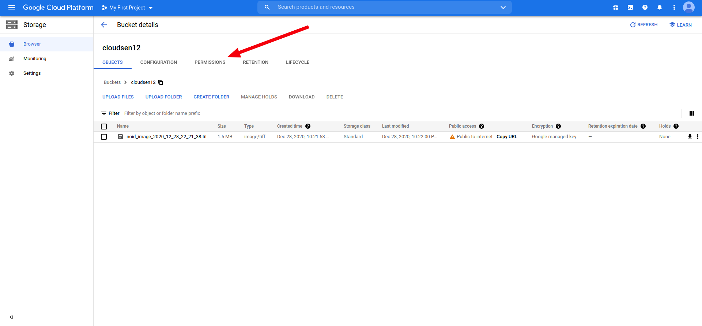
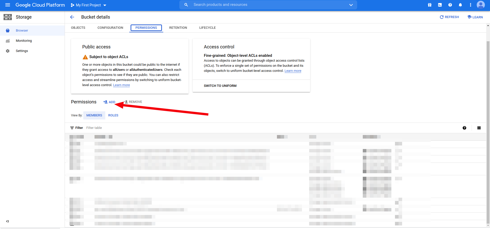
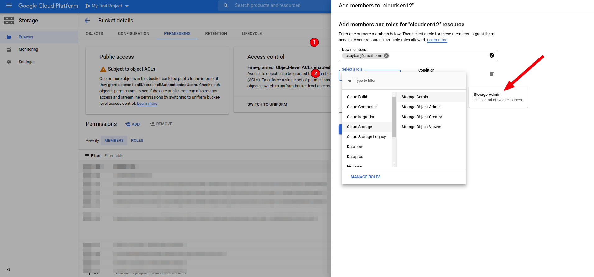
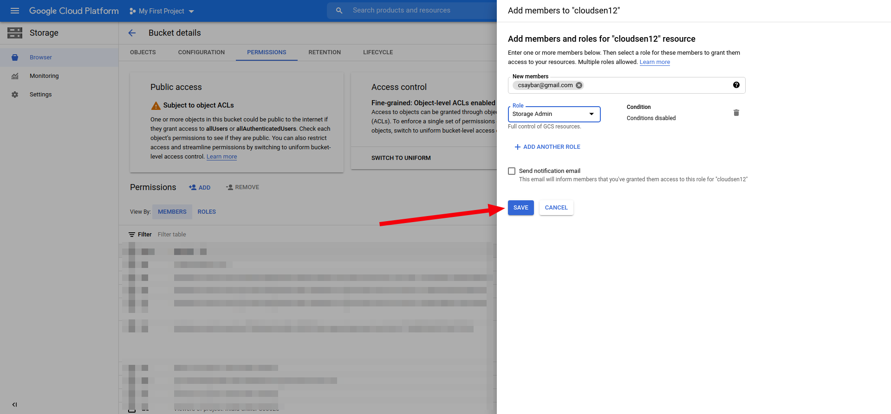
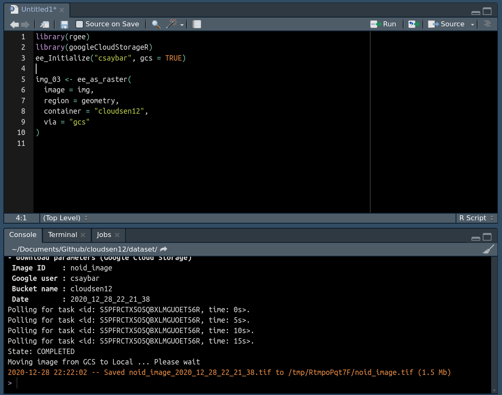

# Creating a valid Service Account key for rgee

## 1. Enter to google cloud [service-account-key](https://console.cloud.google.com/apis/credentials/serviceaccountkey).

## 2. Put a name for your service account key e.g. GCS_AUTH_FILE.json (but any name will be fine).

## 3. Add GCS admin privileges to the service account key.

## 4. Create the key.

## 5. Save the credential in the folder: rgee::ee_get_earthengine_path()

## 6. PSS! You can use the same service account key for multiple users! ... but first give permision to the users :) (Go to Bucket details)

## 7. Click in permissions and add

## 8. Add a new menber a give privileges to manipulate GCS resources.

## 9. Click in save

## 10. That's all now ee_Initialize(gcs=TRUE) will work with no problems!

