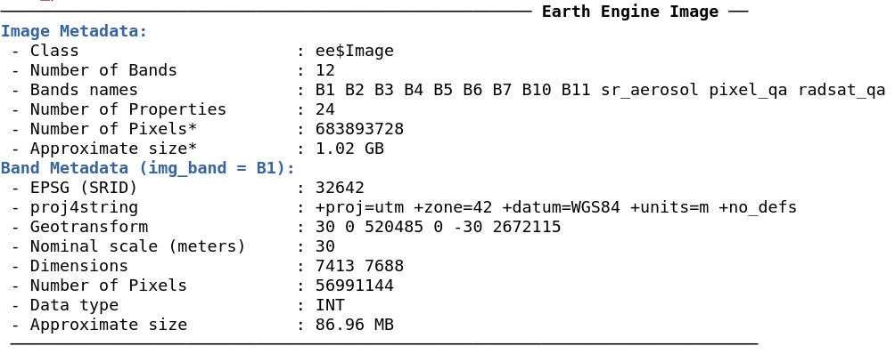

# Summary
Google Earth Engine (GEE) [@gorelick2017google] is a cloud-based platform specifically designed for planetary-scale environmental data analysis. Currently, GEE is made up of 3 components. The data catalog which is continuously updated and permits users to access a dataset of over 40 years of satellite imagery for the whole world.  The Google’s geocomputational infrastructure highly optimized to reduce the time execution of spatial non-recursively procedures. Finally, the Web REST API and the two client libraries (in JavaScript and Python) permits users to interact with the server-side without the necessity to understand the complex system architecture and data distributions models behind GEE. Although the GEE functionality is powerful with more than 800 functions, and the possibility of chaining operations,  there are limitations to creating straightforward input/output pipelines, quality static visualization, metadata display, and efficient management of Earth Engine asset resources. This becomes a more challenging task outside the Python Earth Engine API [@markert2019cartoee].

This paper introduces **rgee**, an Earth Engine client library for R. The goal of **rgee** is to allows users to leverage the strengths of the R spatial ecosystem and Google Earth Engine in the same workflow. All the classes and the existing functionality of the two Google's supported client libraries can be called through the dollar sign (`$`). `rgee` adds several new features such as (i) new I/O design, (ii) multiple user support, (iii) easily extraction of time series, (iv) asset manage interface, and (v) metadata display, also with `rgee` is possible the execution of Earth Engine Python code from within R which make the translation of large Python projects unnecessary.  

# Features

## I/O Enhanced

**rgee** implements several functions to support the download/upload of image and vector datasets (Table 1 and Table 2). For instance, to download images located on the server-side you might use either `ee_image_as_raster` or `ee_image_as_stars`. All the direct download functions (EE server-side to local) implemented in `rgee` have the option to download via using an intermediate container (Google Drive or Google Cloud Storage) or a REST call ("$getInfo"). Although the last option permits users a quick download, there is a limitation of 262144 pixels (for images) or 5000 elements (for featurecollections) by request which makes it not recommendable for large objects. The others implemented functions (Table 1) will permit you to create more customized download workflows, for instance, using `ee_image_to_drive` and `ee_drive_to_local` users could create scripts which save results in a `.TFRecord` rather than a `.GeoTIFF` format. The upload process follows the same logic. In **rgee** we implement `raster_as_ee`, `stars_as_ee` for upload images and `sf_as_ee` for vector data. Large uploads are just possible through a Google Cloud Storage account active. 

|         	|                   	|      FROM      	|       TO      	|       RETURN       	|
|---------	|-------------------	|:--------------:	|:-------------:	|:------------------:	|
| Image   	| ee_image_to_drive 	| EE server-side 	|     Drive     	|   Unstarted task   	|
|         	| ee_image_to_gcs   	| EE server-side 	| Cloud Storage 	|   Unstarted task   	|
|         	| ee_image_to_asset 	| EE server-side 	|    EE asset   	|   Unstarted task   	|
|         	| ee_as_raster      	| EE server-side 	|     Local     	| RasterStack object 	|
|         	| ee_as_stars       	| EE server-side 	|     Local     	| Proxy-stars object 	|
| Table   	| ee_table_to_drive 	| EE server-side 	|     Drive     	|   Unstarted task   	|
|         	| ee_table_to_gcs   	| EE server-side 	| Cloud Storage 	|   Unstarted task   	|
|         	| ee_table_to_asset 	| EE server-side 	|    EE asset   	|   Unstarted task   	|
|         	| ee_as_sf          	| EE server-side 	|     Local     	|      sf object     	|
| Generic 	| ee_drive_to_local 	|      Drive     	|     Local     	|   object filename  	|
|         	| ee_gcs_to_local   	|  Cloud Storage 	|     Local     	|     GCS filename  	|

: Download functions provided by package rgee. \label{table:1}

|         	|                 	|      FROM     	|       TO      	|            RETURN           	|
|---------	|-----------------	|:-------------:	|:-------------:	|:---------------------------:	|
| Image   	| gcs_to_ee_image 	| Cloud Storage 	|    EE asset   	|          EE Asset ID       	  |
|         	| raster_as_ee    	|     Local     	|    EE asset   	|          EE Asset ID       	  |
|         	| stars_as_ee     	|     Local     	|    EE asset   	|          EE Asset ID       	  |
| Table   	| gcs_to_ee_table 	| Cloud Storage 	|    EE asset   	|          EE Asset ID       	  |
|         	| sf_as_ee        	|     Local     	|    EE asset   	|          EE Asset ID       	  |
| Generic 	| local_to_gcs    	|     Local     	| Cloud Storage 	|         GCS filename        	|

: Upload functions provided by package rgee. \label{table:2}

## Multiple users

`rgee` offers users the possibility to arrange multiple credentials (Google Earth Engine, Google Drive, and Google Cloud Storage) for multiple users through the function `ee_Initialize` (a wrapper around `ee$Initialize`). This function will permit set up users credentials quickly since they are all saved in the path: `~/.config/earthengine`. It is extremely useful to parallelize exporting and importing tasks from the client-side. For instance, if a group of researchers wants to analyze the deforestation, the code bellow will permit them to obtain results three-times faster:

```r
library(foreach)
library(rgee)

google_account <- c("csaybar", "ryali93", "lbautista")

foreach(account = google_account, .combine = "c") %dopar% {
  ee_Initialize(gmail)
  ic_results <- temporal_deforestation(split = ...)
  ee_imagecollection_to_local(ic_results)
} -> results
```

## Extraction of time series

`rgee` can extract values from `ee.Image` and `ee.ImageCollection` at the location of `ee.Geometry`, `ee.Feature`, `ee.FeatureCollection` and `sf` objects. If the geometry is a polygon, users can summarize the values considering a built-in Earth Engine reducer function. The code below explains how to extract the average areal rainfall for precipitation mean composite.

```r
library(rgee)
library(sf)

ee_Initialize()

# Image or ImageCollection (mean composite)
terraclimate <- ee$ImageCollection("IDAHO_EPSCOR/TERRACLIMATE")$
  filterDate("2001-01-01", "2002-01-01")$
  map(function(x) x$select("pr"))$
  mean()$rename("pp_mean") 

# Define a geometry
nc <- st_read(system.file("shape/nc.shp", package = "sf"))

# Extract the average areal rainfall
ee_nc_rain <- ee_extract(terraclimate, nc, sf = TRUE)
plot(ee_nc_rain["pp_mean"])
```

{ width=70% }


## Asset Manage Interface

`rgee` inspired in previous works [@samapriya_roy_2020_3772053] implement an interface to batch actions on assets which extend capabilities of the existing GEE data module (ee.data.\*). The interface is composed for a series of functions, and users can identify them by the prefix ee_manage_\*. Between the actions that the Asset Manage Interface enables we have: creation and elimination of folders, moving and copy assets, set and delete properties, handle the access control lists, and to manage or cancel tasks. For example, users could move a Landsat 8 image to their personal EE asset as follow:

```r
library(rgee)
ee_Initialize()

server_path <- "LANDSAT/LC08/C01/T1/"
user_asset_path <- ee_get_assethome()

ee_manage_copy(
  path_asset = paste0(server_path,"/LC08_044034_20140318"),
  final_path = paste0(user_asset_path,"/LC08_044034_20140318")
)
```

## Metadata display

`rgee` through `ee_print` can fetch and return metadata (Fig .2) about spatial Earth Engine objects. With `ee_print` the  acquire of information about the number of images or features, number of bands or geometries, number of pixels, geotransform, datatype, properties and aproximate size of the object can be made with a single line of code. `ee_print` was designed to be used inside debugging pipelines (e.g. inside the ee.Image.aside function).

```r
library(rgee)

ee_Initialize()
l8 <- ee$Image("LANDSAT/LC08/C01/T1/LC08_044034_20140318")
ee_print(l8)
```


# Availability

`rgee` is open source software made available under the Apache 2.0 license. It can be installed through CRAN (------) using: install.packages("------"). `rgee` can also be installed from its GitHub repository using the remotes package: remotes::install_github("-------"). A serie of examples about the use of `rgee` are available [here](https://csaybar.github.io/rgee-examples/README.html).

# References
