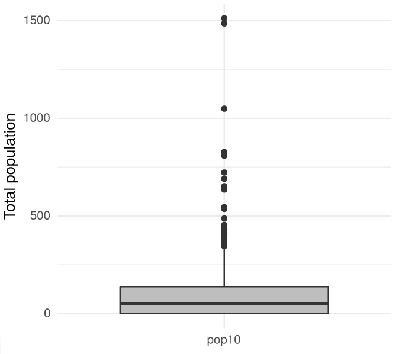

# Summary
Google Earth Engine [@gorelick2017google] is a cloud-based platform designed for planetary-scale environmental data analysis. Its multi-petabyte data catalog and computation services are accessed via an Internet-accessible API. The API is exposed through JavaScript and Python client libraries. Google provides a browser-based IDE for the JavaScript API, and while convenient and useful for rapid data exploration and script development, it does not allow third-party package integration, relying solely on Google Maps and Google Charts for data visualization, and proprietary systems for metadata viewing and asset management. By contrast, the Python and Node.js distributions offer much flexibility for developers to integrate with third-party libraries, but without the structure of a dedicated IDE, casual users can be left directionless and daunted. A significant gap exists between these two offerings (Google-supported JavaScript IDE and base client libraries) where convenience and flexibility meet. We propose to fill this gap with an R package that wraps the Earth Engine Python API to provide R users with a familiar interface, rapid development features, and flexibility to analyze data using open-source, third-party packages.

rgee is an Earth Engine client library for R that allows users to leverage the strengths of the R spatial ecosystem and Google Earth Engine in the same workflow. All of the Earth Engine Python API classes, modules, and functions are made available through the reticulate package, which embeds a Python session within an R session, enabling seamless interoperability. Additionally, rgee adds several new features such as (i) new I/O design, (ii) multiple user support, (iii) Interactive map display,  (iv) easy extraction of time series, (iv) asset manage interface, and (v) metadata display, also with rgee is possible the execution of Earth Engine Python code from within R which make the translation of large Python projects unnecessary.

# Features

## I/O Enhanced

`rgee` implements several functions to support download/upload of image and vector files (Table 1 and Table 2). For instance, to download images and save them in a local environment you might use either `ee_image_as_raster` or `ee_image_as_stars`. Both functions have the option to fetch data using an intermediate container (Google Drive or Google Cloud Storage) or through a REST call ("$getInfo"). Although the last option permits users a quick download, there is a limitation of 262144 pixels (for ee.Image) or 5000 elements (for ee.FeatureCollection) by request which makes it not recommendable for large objects. The others implemented functions (Table 1) create more customized download workflows. For instance, using `ee_image_to_drive` and `ee_drive_to_local` users could create scripts which save results in a `.TFRecord` rather than a `.GeoTIFF` format. 

|         	|                   	|      FROM      	|       TO      	|       RETURN       	|
|---------	|-------------------	|:--------------:	|:-------------:	|:------------------:	|
| Image   	| ee_image_to_drive 	| EE server-side 	|     Drive     	|   Unstarted task   	|
|         	| ee_image_to_gcs   	| EE server-side 	| Cloud Storage 	|   Unstarted task   	|
|         	| ee_image_to_asset 	| EE server-side 	|    EE asset   	|   Unstarted task   	|
|         	| ee_as_raster      	| EE server-side 	|     Local     	| RasterStack object 	|
|         	| ee_as_stars       	| EE server-side 	|     Local     	| Proxy-stars object 	|
| Table   	| ee_table_to_drive 	| EE server-side 	|     Drive     	|   Unstarted task   	|
|         	| ee_table_to_gcs   	| EE server-side 	| Cloud Storage 	|   Unstarted task   	|
|         	| ee_table_to_asset 	| EE server-side 	|    EE asset   	|   Unstarted task   	|
|         	| ee_as_sf          	| EE server-side 	|     Local     	|      sf object     	|
| Generic 	| ee_drive_to_local 	|      Drive     	|     Local     	|   object filename  	|
|         	| ee_gcs_to_local   	|  Cloud Storage 	|     Local     	|     GCS filename  	|

: Download functions provided by package rgee. \label{table:1}

The upload process follows the same logic. In rgee we implement `raster_as_ee`, `stars_as_ee` for upload images and sf_as_ee for vector data. Large uploads are just possible with an active Google Cloud Storage account. The next example illustrate the benefit of the I/O module which permits a seamless integration between rgee and ggplot2 to display metadata.

|         	|                 	|      FROM     	|       TO      	|            RETURN           	|
|---------	|-----------------	|:-------------:	|:-------------:	|:---------------------------:	|
| Image   	| gcs_to_ee_image 	| Cloud Storage 	|    EE asset   	|          EE Asset ID       	  |
|         	| raster_as_ee    	|     Local     	|    EE asset   	|          EE Asset ID       	  |
|         	| stars_as_ee     	|     Local     	|    EE asset   	|          EE Asset ID       	  |
| Table   	| gcs_to_ee_table 	| Cloud Storage 	|    EE asset   	|          EE Asset ID       	  |
|         	| sf_as_ee        	|     Local     	|    EE asset   	|          EE Asset ID       	  |
| Generic 	| local_to_gcs    	|     Local     	| Cloud Storage 	|         GCS filename        	|

: Upload functions provided by package rgee. \label{table:2}


```r
library(tidyverse)
library(rgee)
library(sf)

ee_Initialize()

# Region of interest
roi <- ee$Geometry$Rectangle(-122.27, 37.86, -122.24, 37.89)

# TIGER: US Census Blocks Dataset
blocks <- ee$FeatureCollection("TIGER/2010/Blocks")
subset <- blocks$filterBounds(roi)

# From Earth Engine to Local Env
sf_subset <- ee_as_sf(x = subset)

# Creat a boxplot with ggplot2
sf_subset[c("pop10")] %>% 
  st_set_geometry(NULL) %>% 
  as_tibble() %>% 
  rename(value = "pop10") %>% 
  mutate(name = "pop10") %>% 
  ggplot(aes(x = name, y = value)) +
  geom_boxplot(fill='gray') +
  xlab("") + ylab("number of housing units") +
  theme_minimal()
```
{ width=50% }


## Multiple users

`rgee` implement the ee_Initialize function (a wrapper around ee$Initialize) which offers users the possibility to arrange multiple credentials (Google Earth Engine, Google Drive, and Google Cloud Storage) for multiple users. This feature open the possibility to distribute requests by accounts (in other words, parallelize in the client-side). For instance, if a research group want to analyze the deforestation the code bellow will permit them to obtain results three-times faster:

```r
library(foreach)
library(rgee)

google_account <- c("csaybar", "ryali93", "lbautista")

foreach(account = google_account, .combine = "c") %dopar% {
  ee_Initialize(gmail)
  ic_results <- temporal_deforestation(split = google_account)
  ee_imagecollection_to_local(ic_results)
} -> results
```

## Interactive Map Display
rgee offers interactive map display through  "Map\$addLayer", an R function which mimics the mapping module of the Earth Engine code editor. Map\$addLayer takes advantage of the `getMapId` Earth Engine method to fetch and return a ID dictionary which is used to create layer into a mapview [@appelhans2016mapview] object. Users can provide visualization parameters to the Map\$addLayer function by using the argument visParams, as we can see here:

```r
library(rgee)
ee$Initialize()

# Load an ee.Image
image <- ee$Image("LANDSAT/LC08/C01/T1/LC08_044034_20140318")

# Centers the map view
Map$centerObject(image)

# Display the ee.Image
Map$addLayer(
  eeObject = image, 
  visParams = list(bands = c("B4", "B3", "B2"), max = 10000), 
  name = "SF"
)
```

## Extraction of time series

`rgee` can extract values from `ee.Image` and `ee.ImageCollection` at the location of `ee.Geometry`, `ee.Feature`, `ee.FeatureCollection` and `sf` objects. If the geometry is a polygon, users can summarize the values considering a built-in Earth Engine reducer function. The code below explains how to extract the average areal rainfall for precipitation mean composite.

```r
library(rgee)
library(sf)

ee_Initialize()

# Image or ImageCollection (mean composite)
terraclimate <- ee$ImageCollection("IDAHO_EPSCOR/TERRACLIMATE")$
  filterDate("2001-01-01", "2002-01-01")$
  map(function(x) x$select("pr"))$
  mean()$rename("pp_mean") 

# Define a geometry
nc <- st_read(system.file("shape/nc.shp", package = "sf"))

# Extract the average areal rainfall
ee_nc_rain <- ee_extract(terraclimate, nc, sf = TRUE)
plot(ee_nc_rain["pp_mean"])
```

{ width=70% }


## Asset Manage Interface

`rgee` implement an interface to batch actions on assets which extend capabilities of the existing GEE data module (ee.data.\*). The interface is composed for a series of functions, and users can identify them by the prefix ee_manage_\*. Between the actions that the Asset Manage Interface enables we have: creation and elimination of folders, moving and copy assets, set and delete properties, handle the access control lists, and to manage or cancel tasks. For example, users could move a Landsat 8 image to their personal EE asset as follow:

```r
library(rgee)
ee_Initialize()

server_path <- "LANDSAT/LC08/C01/T1/"
user_asset_path <- ee_get_assethome()

ee_manage_copy(
  path_asset = paste0(server_path,"/LC08_044034_20140318"),
  final_path = paste0(user_asset_path,"/LC08_044034_20140318")
)
```

## Metadata display

`rgee` through `ee_print` can fetch and return metadata (Fig .2) about spatial Earth Engine objects. With `ee_print` the  acquire of information about the number of images or features, number of bands or geometries, number of pixels, geotransform, datatype, properties and aproximate size of the object can be made with a single line of code. `ee_print` was designed to be used inside debugging pipelines (e.g. inside the ee.Image.aside function).

```r
library(rgee)

ee_Initialize()
l8 <- ee$Image("LANDSAT/LC08/C01/T1/LC08_044034_20140318")
ee_print(l8)
```


# Availability

`rgee` is open source software made available under the Apache 2.0 license. It can be installed through CRAN (------) using: install.packages("------"). `rgee` can also be installed from its GitHub repository using the remotes package: remotes::install_github("-------"). A serie of examples about the use of `rgee` are available [here](https://csaybar.github.io/rgee-examples/README.html).

# References
