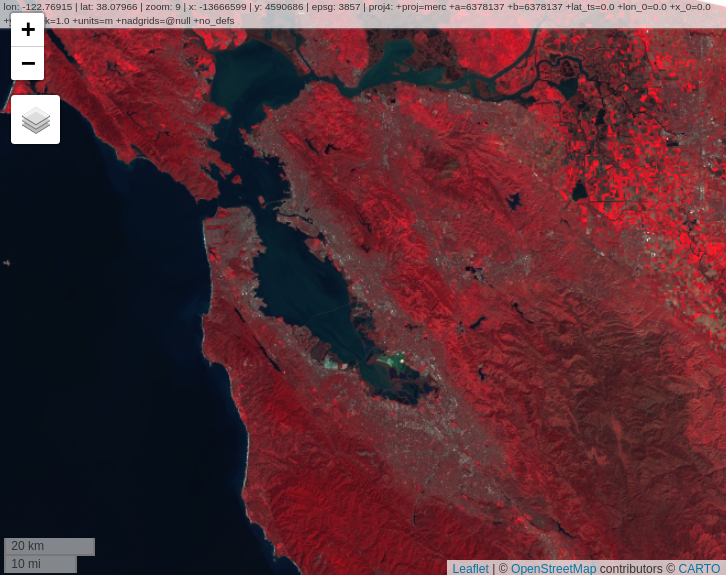
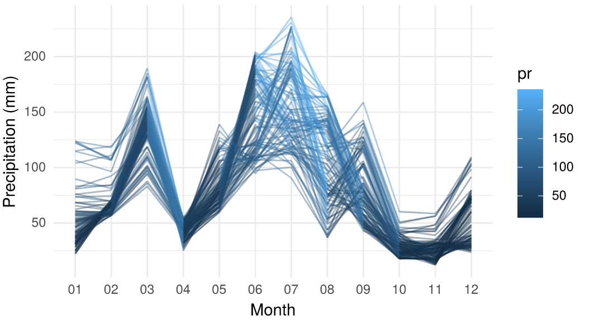
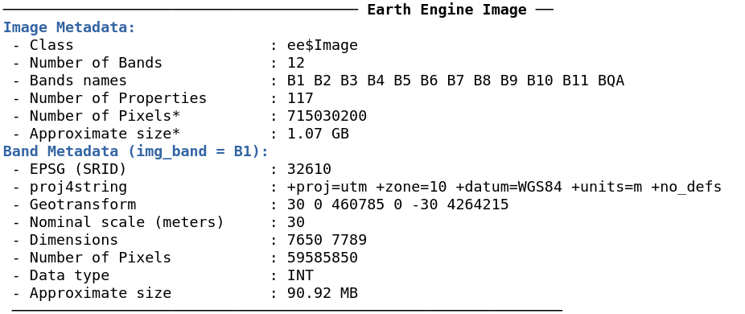

# Summary
Google Earth Engine [@gorelick2017google] is a cloud computing platform designed for planetary-scale environmental data analysis. Its multi-petabyte data catalog and computation services are accessed via an Internet-accessible API. The API is exposed through JavaScript and Python client libraries. Google provides a browser-based IDE for the JavaScript API, and while convenient and useful for rapid data exploration and script development, it does not allow third-party package integration, relying solely on Google Maps and Google Charts for data visualization, and proprietary systems for metadata viewing and asset management. In contrast, the Python and Node.js distributions offer much flexibility for developers to integrate with third-party libraries. However, without the structure of a dedicated IDE, casual users can be left directionless and daunted. A significant gap exists between these two offerings (Google-supported JavaScript IDE and base client libraries) where convenience and flexibility meet. We propose to fill this gap with an R package that wraps the Earth Engine Python API to provide R users with a familiar interface, rapid development features, and flexibility to analyze data using open-source, third-party packages.

rgee is an Earth Engine (EE) client library for R that allows users to leverage the strengths of the R spatial ecosystem and Google Earth Engine in the same workflow. All of the Earth Engine Python API classes, modules, and functions are made available through the reticulate package [@reticulate], which embeds a Python session within an R session, enabling seamless interoperability. Additionally, rgee adds several new features such as (i) new I/O design, (ii) interactive map display,  (iii) easy extraction of time series, (iv) asset management interface, and (v) metadata display. In addition, rgee also makes it possible to execute Earth Engine Python code from within R, making the translation of large Python projects unnecessary.

# Features

## Enhanced I/O 

rgee implements several functions to support download/upload of spatial objects (Table \ref{table:1} and Table \ref{table:2}). For instance, to download vector (image) files one can use `ee_as_sf` (`ee_as_raster` or `ee_as_stars`). In rgee, all the functions from server to local side have the option to fetch data using an intermediate container (Google Drive or Google Cloud Storage) or through a REST call ("$getInfo"). Although the latter option performs a quick download, there is a request limit of 262144 pixels for `ee$Image` and 5000 elements for `ee$FeatureCollection` which makes it unsuitable for large objects. Other download functions, from server-side to others (see Table \ref{table:1}), are implemented to enable more customized download workflows. For example, using `ee_image_to_drive` and `ee_drive_to_local` users could create scripts which save results in the `.TFRecord` rather than the `.GeoTIFF` format. The upload process follows the same logic (Table \ref{table:2}). rgee includes `raster_as_ee` and `stars_as_ee` for uploading images and `sf_as_ee` for uploading vector data. Large uploads are only possible with an active Google Cloud Storage account.


|         	|                   	|      FROM      	|       TO      	|       RETURN       	|
|---------	|-------------------	|:--------------:	|:-------------:	|:------------------:	|
| Image   	| ee_image_to_drive 	|    EE server   	|     Drive     	|   Unstarted task   	|
|         	| ee_image_to_gcs   	|    EE server   	| Cloud Storage 	|   Unstarted task   	|
|         	| ee_image_to_asset 	|    EE server   	|    EE asset   	|   Unstarted task   	|
|         	| ee_as_raster      	|    EE server   	|     Local     	| RasterStack object 	|
|         	| ee_as_stars       	|    EE server   	|     Local     	| Proxy-stars object 	|
| Table   	| ee_table_to_drive 	|    EE server   	|     Drive     	|   Unstarted task   	|
|         	| ee_table_to_gcs   	|    EE server   	| Cloud Storage 	|   Unstarted task   	|
|         	| ee_table_to_asset 	|    EE server   	|    EE asset   	|   Unstarted task   	|
|         	| ee_as_sf          	|    EE server   	|     Local     	|      sf object     	|
| Generic 	| ee_drive_to_local 	|      Drive     	|     Local     	|   object filename  	|
|         	| ee_gcs_to_local   	|  Cloud Storage 	|     Local     	|     GCS filename  	|

: Download functions provided by the rgee package. \label{table:1}


|         	|                 	|      FROM     	|       TO      	|            RETURN           	|
|---------	|-----------------	|:-------------:	|:-------------:	|:---------------------------:	|
| Image   	| gcs_to_ee_image 	| Cloud Storage 	|    EE asset   	|          EE Asset ID       	  |
|         	| raster_as_ee    	|     Local     	|    EE asset   	|          EE Asset ID       	  |
|         	| stars_as_ee     	|     Local     	|    EE asset   	|          EE Asset ID       	  |
| Table   	| gcs_to_ee_table 	| Cloud Storage 	|    EE asset   	|          EE Asset ID       	  |
|         	| sf_as_ee        	|     Local     	|    EE asset   	|          EE Asset ID       	  |
| Generic 	| local_to_gcs    	|     Local     	| Cloud Storage 	|         GCS filename        	|

: Upload functions provided by the rgee package. \label{table:2}

The following example illustrates how to integrate the rgee I/O module and ggplot2 [@wickham2011ggplot2] to download and visualize metadata for the [BLM AIM TerrestrialAIM](https://developers.google.com/earth-engine/datasets/catalog/BLM_AIM_v1_TerrADat_TerrestrialAIM#description) dataset.

```r
library(tidyverse)
library(rgee)
library(sf)

ee_Initialize()

# Define a Region of interest
roi <- ee$Geometry$Point(-120.06227, 40.64189)$buffer(25000)

# Load TerrADat TerrestrialAIM Dataset
blocks <- ee$FeatureCollection("BLM/AIM/v1/TerrADat/TerrestrialAIM")
subset <- blocks$filterBounds(roi)

# Move an Earth Engine FeatureCollection to their local env
sf_subset <- ee_as_sf(x = subset)

# Create a boxplot with ggplot2
gapPct <- c("_25_50" = "GapPct_25_50","_51_100"="GapPct_51_100",
            "101_200" = "GapPct_101_200","200_>" = "GapPct_200_plus")

sf_subset[gapPct] %>% 
  st_set_geometry(NULL) %>% 
  as_tibble() %>% 
  rename(!!gapPct) %>% 
  pivot_longer(seq_along(gapPct), names_to = "Range") %>% 
  ggplot(aes(x = Range, y = value, fill = Range)) +
  geom_boxplot() +
  xlab("") + ylab("% of the plot's soil surface") +
  theme_minimal()
```
{ width=65% }

## Interactive Map Display
rgee offers interactive map display through  `Map$addLayer`, an R function mimicking the mapping module of the Earth Engine JavaScript Code Editor. `Map$addLayer` takes advantage of the `getMapId` EE method to fetch and return an ID dictionary being used to create layers in a mapview [@appelhans2016mapview] object. Users can specify visualization parameters to `Map$addLayer` by using the visParams argument, as demostrated below:

```r
library(rgee)
ee_Initialize()

# Load an ee$Image
image <- ee$Image("LANDSAT/LC08/C01/T1/LC08_044034_20140318")

# Centers the map view
Map$centerObject(image)

# Display the ee$Image
Map$addLayer(
  eeObject = image, 
  visParams = list(bands = c("B4", "B3", "B2"), max = 10000), 
  name = "SF"
)
```

{ width=70% }

## Extraction of time series

rgee can extract values from `ee$Image` and `ee$ImageCollection` objects at a certain location based on `ee$Geometry`, `ee$Feature`, `ee$FeatureCollection` and `sf` objects. If the geometry is a polygon, users can summarize the values using built-in Earth Engine reducer functions. The code below explains how to extract the average areal rainfall from North Carolina counties using the [TerraClimate](https://developers.google.com/earth-engine/datasets/catalog/IDAHO_EPSCOR_TERRACLIMATE) dataset.

```r
library(ggplot2)
library(tidyr)
library(dplyr)
library(rgee)
library(sf)

ee_Initialize()

# Filter the terraclimate dataset by dates, reproject
# and select only the band "pr".
terraclimate <- ee$ImageCollection("IDAHO_EPSCOR/TERRACLIMATE")$
  filterDate("2001-01-01", "2002-01-01")$
  map(function(x) x$reproject("EPSG:4326")$select("pr"))

# Define a geometry
nc <- st_read(system.file("shape/nc.shp", package = "sf"))

# Extract the average areal rainfall
ee_nc_rain <- ee_extract(terraclimate, nc, sf = FALSE)
colnames(ee_nc_rain) <- sprintf("%02d", 1:12)
ee_nc_rain$name <- nc$NAME

# Create a data frame in a tidy format and display rainfall values
ee_nc_rain %>%
  pivot_longer(-name, names_to = "month", values_to = "pr") %>%
  ggplot(aes(x = month, y = pr, group = name, color = pr)) +
  geom_line(alpha = 0.4) +
  xlab("Month") +
  ylab("Precipitation (mm)") +
  theme_minimal()
```

{ width=80% }


## Asset Management Interface

rgee implements an interface to batch actions on assets extending capabilities of the existing EE data module (`ee$data$*`). The interface allows users to create and eliminate folders, move and copy assets, set and delete properties, handle access control lists, and manage or cancel tasks. For example, users can copy a Landsat 8 image to their personal EE assets as follows:

```r
library(rgee)
ee_Initialize()

server_path <- "LANDSAT/LC08/C01/T1/"
user_asset_path <- ee_get_assethome()

ee_manage_copy(
  path_asset = paste0(server_path,"/LC08_044034_20140318"),
  final_path = paste0(user_asset_path,"/LC08_044034_20140318")
)
```

## Metadata display
The `ee_print` function can save and display all metadata related to EE spatial objects. With `ee_print`, users can retrieve information about the number of images or features, number of bands or geometries, number of pixels, geotransform, datatype, properties and approximate object size. `ee_print` can be used inside debugging pipelines (e.g. linking with `ee$Image$aside`).

```r
library(rgee)

ee_Initialize()
l8 <- ee$Image("LANDSAT/LC08/C01/T1/LC08_044034_20140318")
ee_print(l8)
```
{ width=90% }

# Availability

rgee is an open-source software package made available under the Apache 2.0 license. It can be installed through GitHub repository using the remotes package: remotes::install_github("r-spatial/rgee"). A series of examples for using rgee are available at [https://r-spatial.github.io/rgee](https://r-spatial.github.io/rgee).

# Acknowledgments

The authors would like to thank Justin Braaten for his reviewing and helpful comments during the preparation of this manuscript and development of rgee.

# References
