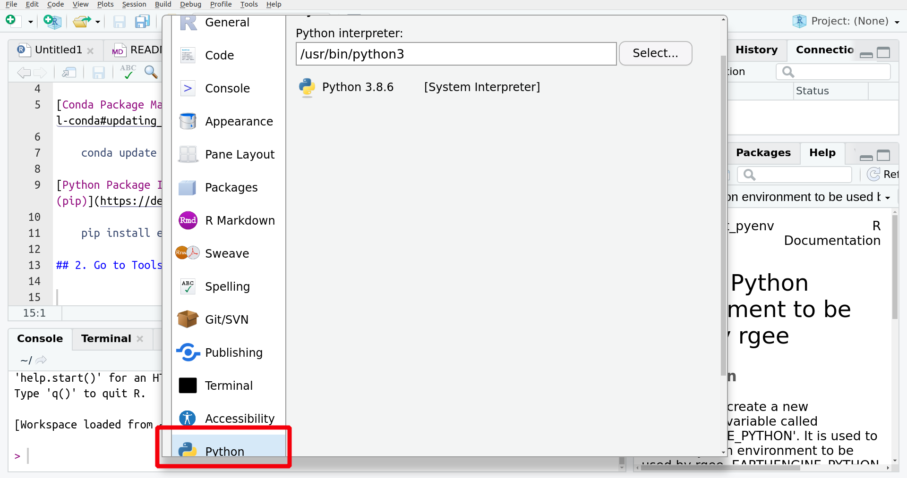

# Connecting a Python Environment with R (rgee) using Rstudio 1.4

## 1. Install the [earthengine-api](https://developers.google.com/earth-engine/guides/python_install) from the terminal.

**MacOS/Linux:**

[Conda Package Manager:](https://developers.google.com/earth-engine/guides/python_install-conda#updating_the_api)

    conda update -c conda-forge earthengine-api

[Python Package Installer (pip)](https://developers.google.com/earth-engine/guides/python_install#pip):

    pip install earthengine-api --upgrade

**Windows:**

Download/Install miniconda:
    
    https://docs.conda.io/en/latest/miniconda.html

[Conda Package Manager:](https://developers.google.com/earth-engine/guides/python_install-conda#updating_the_api)

    conda update -c conda-forge earthengine-api

## 2. Go to Tools \> Global Options \> Python

## 3. Terminate your R session and run again ee_Initialize():

    library(rgee)
    ee_Initialize()
