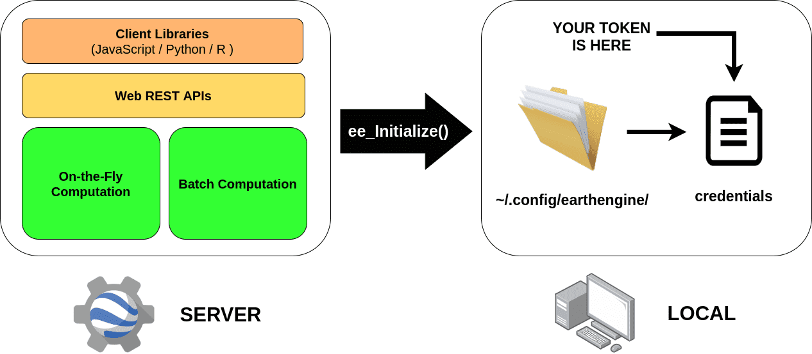

```{r setup, include=FALSE}
knitr::opts_chunk$set(eval = FALSE)
```

Google Earth Engine (GEE) allows users to create apps by three different approaches: **user tokens**, [service accounts](https://developers.google.com/earth-engine/guides/service_account) and [client-side authentication](https://github.com/google/earthengine-api/tree/master/demos/client-auth). In this tutorial, we will get focus on the first option.

## **What is an EE user token (EEtk)?**

An EEtk is a 100-character text string (OAuth2 credential) stored on your local system that is used to identify and authenticate users (See Figure below). In other words, it will permit to connect the EE Web REST API with their local system.

<br>

<center>

</center>

<br>

In **rgee** the authentication procedure is triggered internally by [**ee_Initialize**](https://r-spatial.github.io/rgee/reference/ee_Initialize.html). This [function](https://github.com/google/earthengine-api/blob/b4c068924b1c7574ee717761cb9fe0499a3b932b/python/ee/data.py#L210%60) will search for the '**_credentials_**' file  (it stores the EEtk) on the path: **\~/.config/earthengine/**. 

<br>

```{r}
library(rgee)
sprintf("%s/credentials", dirname(rgee::ee_get_earthengine_path()))
```

<br>

If the file exists, then an [OAuth2 Credential](https://google-auth.readthedocs.io/en/stable/reference/google.oauth2.credentials.html) object is created using a [refresh token](https://developers.google.com/identity/protocols/oauth2) grant. This *refresh token* must come from a Google account registered in GEE if not a *Bad Request error* will be invoked. Once the Oauth2 Credential is successfully loaded, it is dynamically passed to all EE methods (See [Initialize](https://github.com/google/earthengine-api/blob/b4c068924b1c7574ee717761cb9fe0499a3b932b/python/ee/__init__.py#L125)) in order to realize independent calls to the Web REST API. As you realize, the **_credentials_** file is crucial to interact with the EE API and if it does not exist on your system, it will simply not be possible to use rgee.


<center>
<br>
**Please never show or share your token with anyone, it will give full access to all your Earth Engine resources.**
</center>

## **Deploying a simple rgee shiny app on shinyapps.io**

Deploying a rgee application can be a bit tricky, as you must perform the following task:

1. Install R packages.
2. Install Python and third-party packages.
3. **Set the _credentials_ file in the path _~/.config/earthengine/_**.

The first step is automatically accomplished for [**shinyapps.io**](https://www.shinyapps.io/). On the other hand, the second and third steps need to configure manually the virtual machine. To make the process straightforward we create [shiny_rgee](https://github.com/csaybar/shiny_rgee_template) template.

<br>
<center>

</center>
<br>

To use shiny_rgee template, first download it by running on terminal:

```
git clone https://github.com/csaybar/shiny_rgee_template.git
```

Load the rgeeApp.Rproj and modify the .Renviron file according to their personal token user information. It is available in your shinyapps profile https://www.shinyapps.io/admin/#/tokens.

<br>
<center>

</center>

<br>

[**.Renviron**](https://github.com/csaybar/shiny_rgee_template/blob/main/.Renviron)

```
    SHINY_ACC_NAME="your_account_name"
    TOKEN="a_token_you_got_from_shinyapps.io"
    SECRET="a_secret_you_recieved_fromshinyapps.io"
    MASTERNAME="name_of_the_shiny_app"
```
<br>

Finally run the [**deploy.R**](https://github.com/csaybar/shiny_rgee_template/blob/main/deploy.R) file.

```{r}
library(reticulate)
library(rsconnect)
library(rgee)

# 1. Create the credentials file
ee_Initialize()

# 2. Copy credentials file to the project folder
file_credentials <- sprintf("%s/credentials", dirname(rgee::ee_get_earthengine_path()))
file.copy(file_credentials, to = ".")

# 3. Set ShinyApps account info
# FIRST MODIFY LOCAL .Renviron!!
error_on_missing_name <- function(name){
  var <- Sys.getenv(name, unset=NA)
  if(is.na(var)){
    stop(paste0("cannot find ",name),call. = FALSE)
  }
  gsub("\"", '',var)
}

setAccountInfo(name   = error_on_missing_name("SHINY_ACC_NAME"),
               token  = error_on_missing_name("TOKEN"),
               secret = error_on_missing_name("SECRET"))


# 4. Run the application
deployApp(
  appFiles = c("app.R", "utils.R", "credentials"),
  appTitle = "rgee_app_demo",
  lint = FALSE
)

# 5. Delete EE credentials file
file.remove("credentials")
```

<br>

After a couple of minutes, the app will be available on shinyapps.io. 
