```{r setup, include=FALSE}
knitr::opts_chunk$set(eval = FALSE)
```

*Google Cloud Platform may slightly change its website. If this occurs, help us by informing at  [rgee issues](https://github.com/r-spatial/rgee/issues/new). Based on [Interacting with Google Storage in R](https://bookdown.org/hegghammer/interacting_with_google_storage_in_r/interacting_with_google_storage.html) by [Thomas Hegghammer](https://github.com/Hegghammer).*
 

This tutorial explains how to integrate rgee and Google Cloud Storage (GCS) step by step. In rgee, GCS is used as an **intermediary container** for massive downloading/uploading of files which is more flexible than Google Drive. At today's date (December 2021), GCS is free for [uses of less than 0.5 GB](https://cloud.google.com/artifact-registry/pricing).

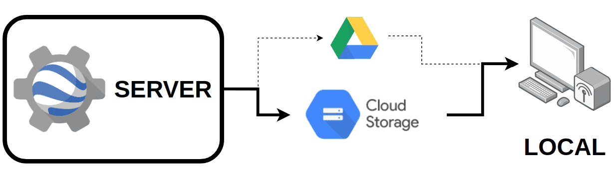

## **Create a Service Account Key**

The bulk of GCS & rgee sync issues is related to the creation of a [service accounts key (SaK)](https://cloud.google.com/iam/docs/creating-managing-service-account-keys) with not enough privileges for
writing/reading in GCS buckets. In order to create, configure and locally store your SaK, perform as follow:


#### **1. Create a Google Cloud Platform (GCP) account**

Go to https://cloud.google.com/, and create an account. You will have to add your address and a credit card.

<br>
<center>
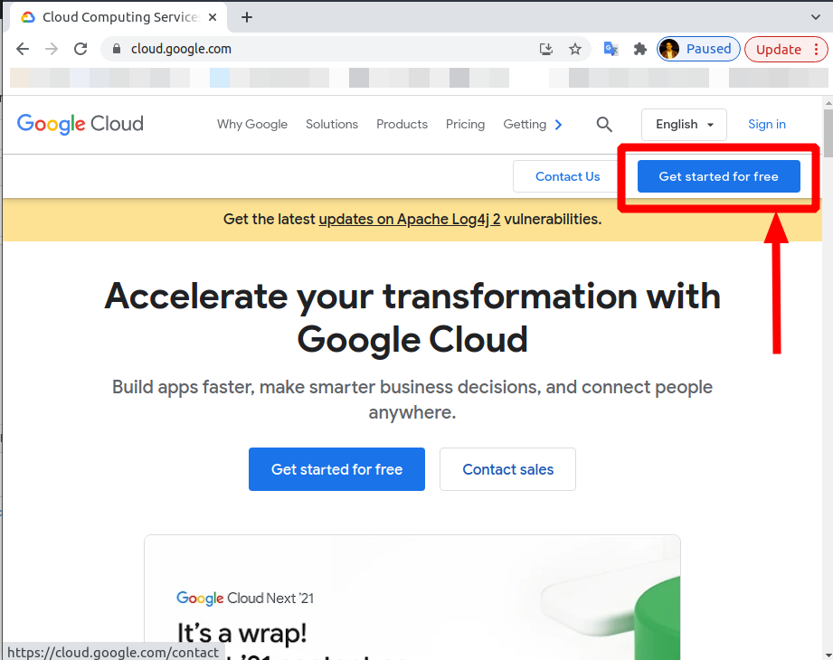
</center>
<br>

#### **2. Create a new project**

Go to console.

<br>
<center>
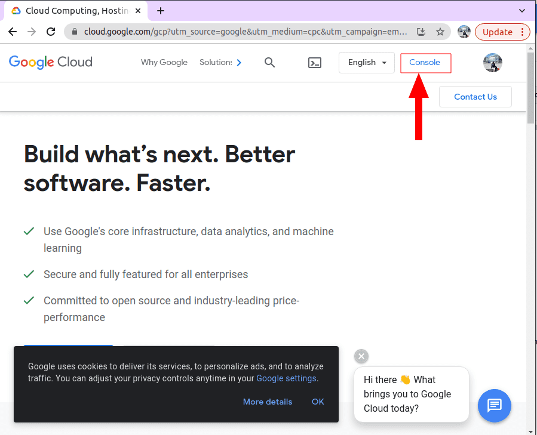
</center>
<br>

If it is your first time using GCP, you are assigned a project named **_My first project_**. If you want to create a new project (**OPTIONAL**). First, click on 'My first project' in the top blue bar, just to the right of 'Google Cloud Platform', and then '**NEW PROJECT**'. 

<br>
<center>

</center>
<br>

Create a project with the desired name.

<center>
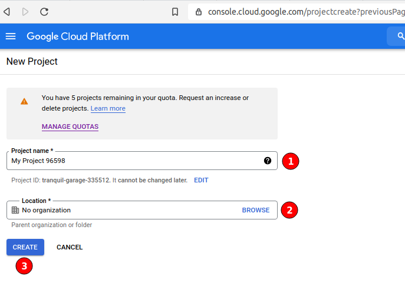
</center>

#### **3. Activate GCS API**

By default, the GCS API is activated. Make sure of it by typing "Cloud Storage API" in the search browser.

<br>
<center>
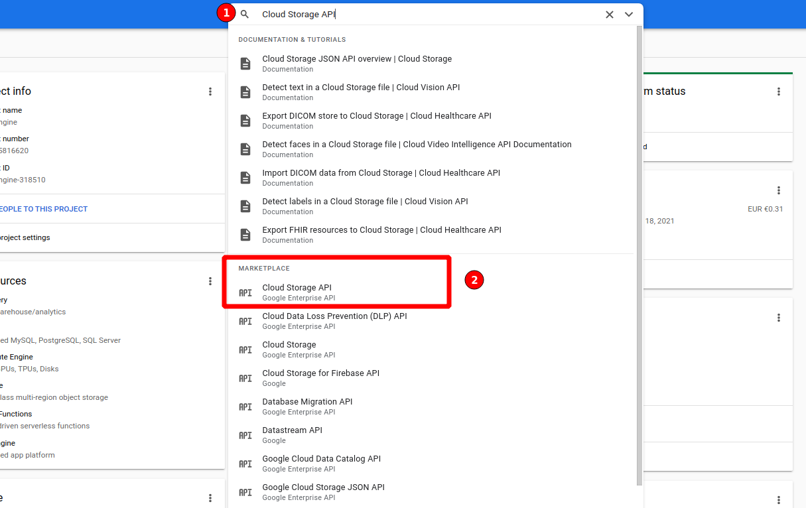
</center>
<br>

Click on 'Enable APIs and Services' (if the API is turned off). A green checkmark as the image below means
that the API is activated!

<br>
<center>
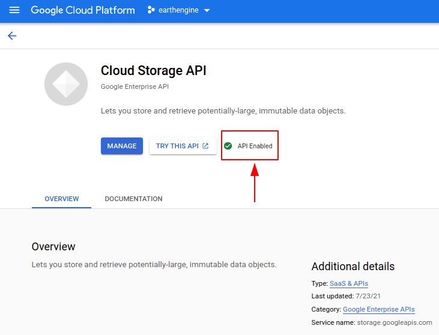
</center>
<br>


#### **4: Set up a service account**

Now we are going to create a [**service account**](https://cloud.google.com/iam/docs/service-accounts). A service account is used to 'sign in' applications that require one or many GCP services. In our case, **rgee** (the app) needs an account with **GCS admin privileges**. To create a service account, search for ‘Cloud Storage’ in the browser, and click on ‘Cloud Storage’ product.


<br>
<center>
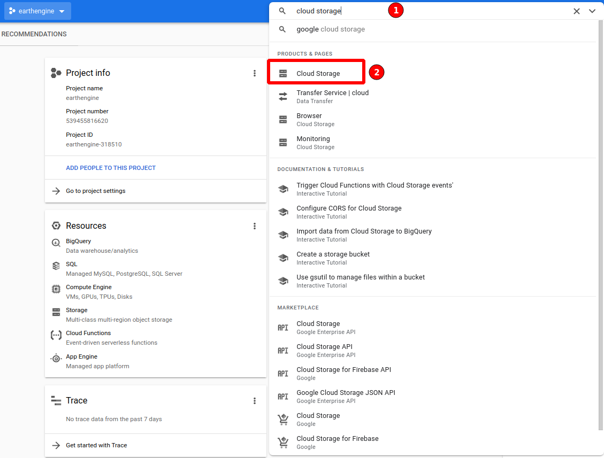
</center>
<br>


Click on 'settings'.

<br>
<center>
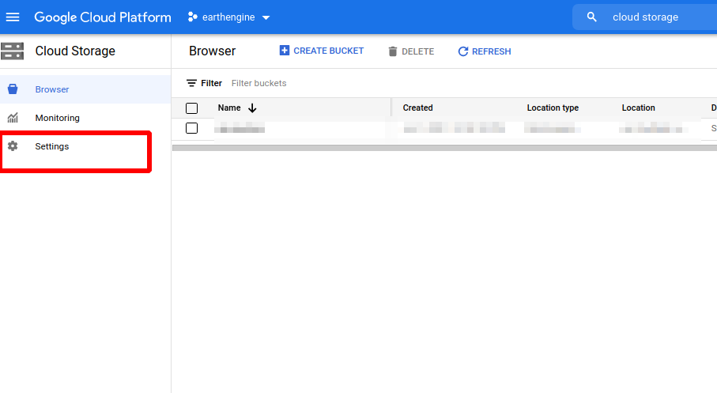
</center>
<br>


Click on 'INTEROPERABILITY', and then click on 'CREATE A KEY FOR A SERVICE ACCOUNT'.

<br>
<center>
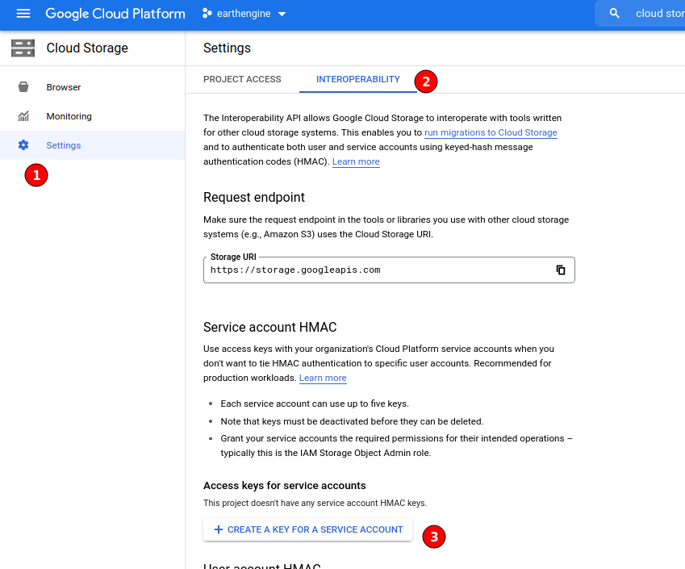
</center>
<br>

Click on 'CREATE NEW ACCOUNT'.

<br>
<center>
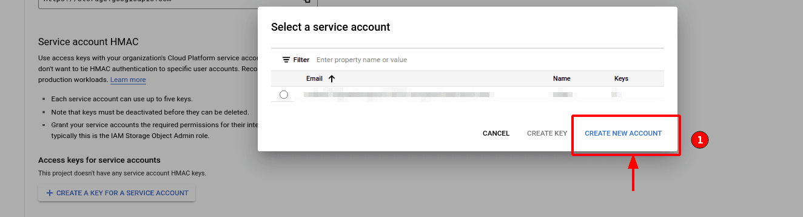
</center>
<br>


Set a name (1), and define **Storage Admin** (**DON'T FORGET THIS STEP!!**) in role (3). 

<br>
<center>
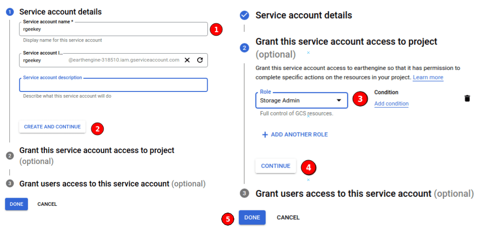
</center>
<br>

#### **5: Create and download a SaK as a json file.**
 
Once create the service account, we have to download the **S**ervice **a**ccount **K**ey to use GCS outside the Google Cloud Platform console. A SaK is just a JSON file with your public/private RSA keys. First, click the small edit icon on the bottom right (three horizontal lines). Then, go to API & Services and click on **credentials**.

<br>
<center>
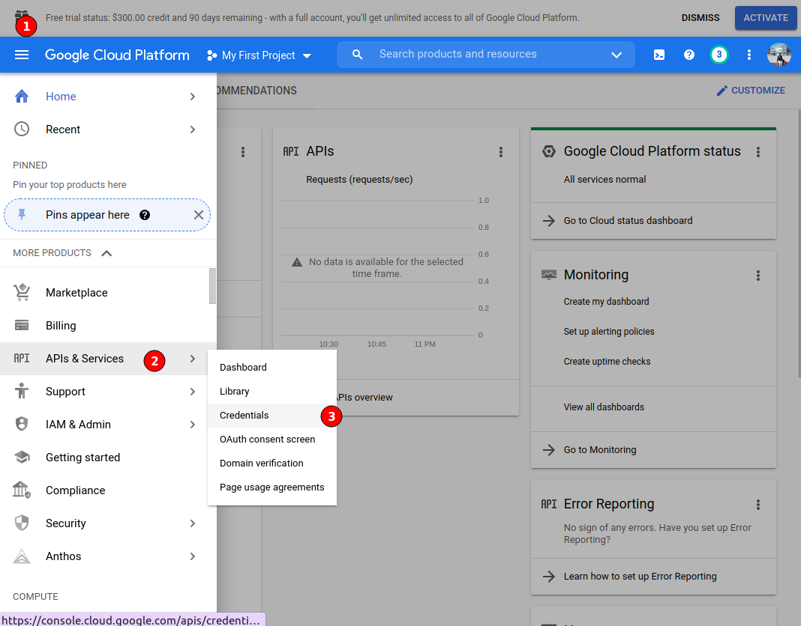
</center>

<br>

On the next page, click on the service account name.

<br>
<center>
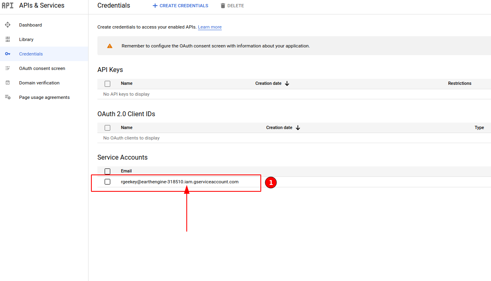
</center>

click on 'KEYS', 'ADD KEY', and 'Create new key'.
<center>
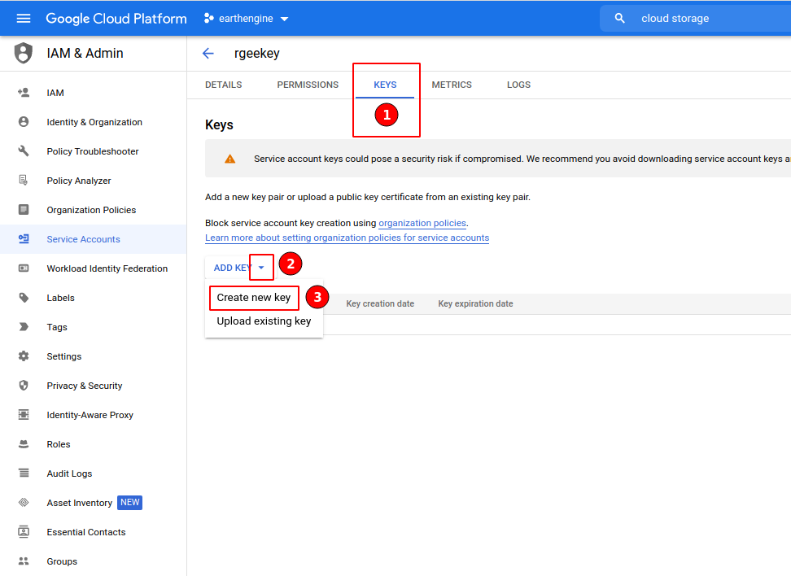
</center>

<br>
Then, select JSON format, and click 'create'.
<br>

<center>
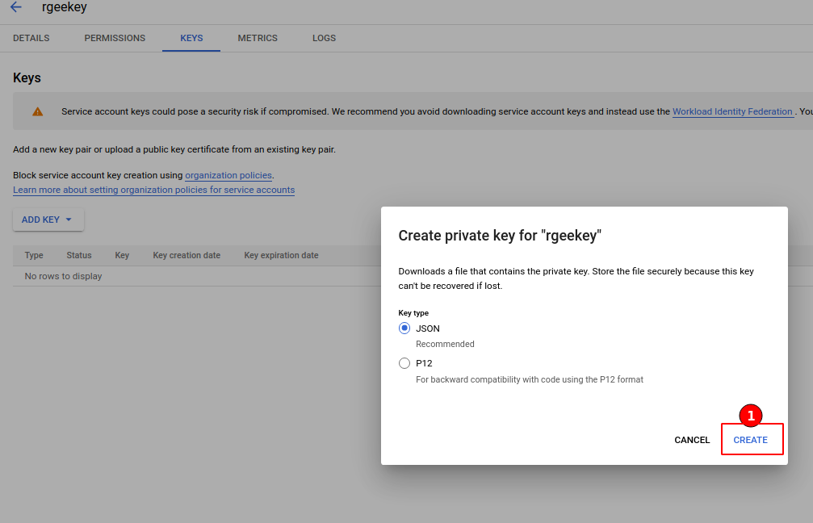
</center>
<br>

This should prompt a save file window. Save the file to your hard drive. You can change the name to something more memorable if you like (**but keep the “.json” extension**). Also, please take note of where you stored it. Now we are done in the Google Cloud Console and can finally start working in RStudio.

## **Copy the SaK in your system**

From rgee v.1.2.9000 we added [ee_utils_sak_copy](https://r-spatial.github.io/rgee/reference/ee_utils_sak_copy.html) and [ee_utils_sak_validate](https://r-spatial.github.io/rgee/reference/ee_utils_sak_validate.html) to help you to validate and store your SaK. Please run as follow to properly set your SaK in your system.

```{r}
# remotes::install_github("r-spatial/rgee") Install rgee v.1.3
library(rgee)

ee_Initialize("csaybar")

SaK_file <- "/home/csaybar/Downloads/SaK_rgee.json" # PUT HERE THE FULLNAME OF YOUR SAK.

# Assign the SaK to a EE user.
ee_utils_sak_copy(
  sakfile =  SaK_file,
  users = c("csaybar", "ryali93") # Unlike GD, we can use the same SaK for multiple users.
)

# Validate your SaK
ee_utils_sak_validate()
```

`ee_utils_sak_validate` evaluate if **rgee** with your SaK can: (1) create buckets, (2) write objects, (3) read objects, and (4) connect GEE and GCS. If it does not retrieve an error, `ee_Initialize(..., gcs = TRUE)` will work like a charm!. The next step is create your own **GCS bucket**. Consider that the bucket name you set must be **globally unique**. In other words, two buckets can not exist with the same name in Google Cloud Storage. 

```{r}
library(rgee)
library(jsonlite)
library(googleCloudStorageR)

ee_Initialize("csaybar", gcs = TRUE)

# Create your own container
project_id <- ee_get_earthengine_path() %>% 
  list.files(., "\\.json$", full.names = TRUE) %>% 
  jsonlite::read_json() %>% 
  '$'(project_id) # Get the Project ID

googleCloudStorageR::gcs_create_bucket("CHOOSE_A_BUCKET_NAME", projectId = project_id)

```

## **ERROR: Cannot insert legacy ACL for an object when uniform bucket-level access is enabled**

This is a [common issue](https://github.com/cloudyr/googleCloudStorageR/issues/111) related to the control access of buckets. GCS offers two systems for granting users permission to access your buckets and objects: [IAM](https://cloud.google.com/storage/docs/access-control/iam) (recommended, used in all Google Cloud services) and [Access Control Lists (ACL)](https://cloud.google.com/storage/docs/access-control/lists) (legacy access control system, only available in GCS).

If you use the Google Cloud Platform console to create a bucket, it will use **Uniform access** (**IAM is used alone to manage permissions**) by default.

<br>
<center>
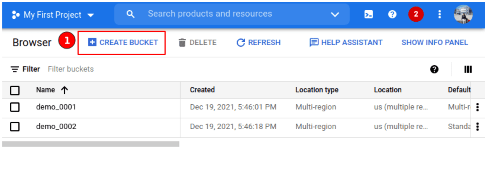
</center>
<center>
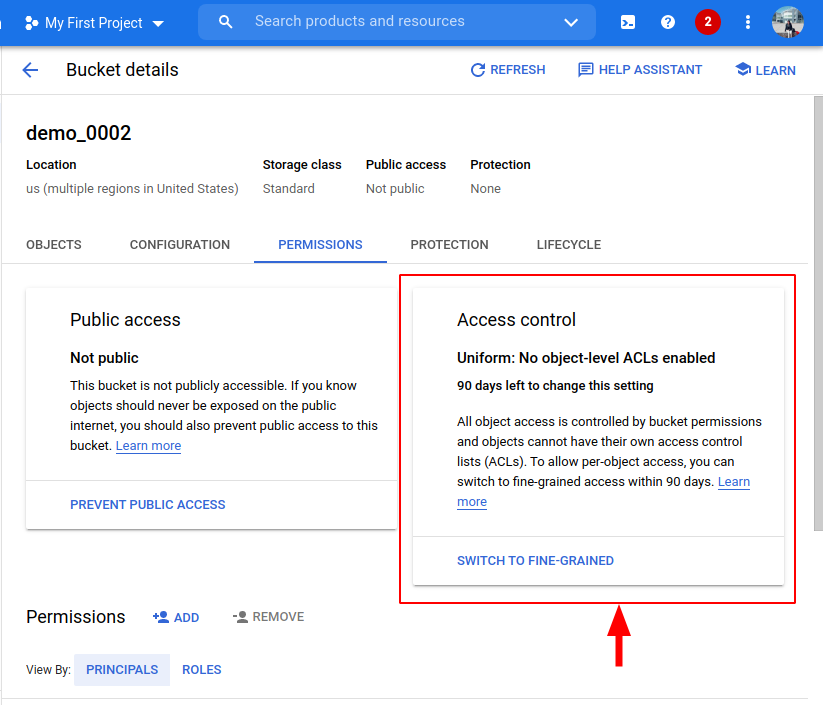
</center>
<br>


On the contrary if you use [`googleCloudStorageR::gcs_create_bucket`](https://code.markedmondson.me/googleCloudStorageR/reference/gcs_create_bucket.html), it will use fine-grained access (**IAM and ACLs to manage permissions**).


<br>
<center>
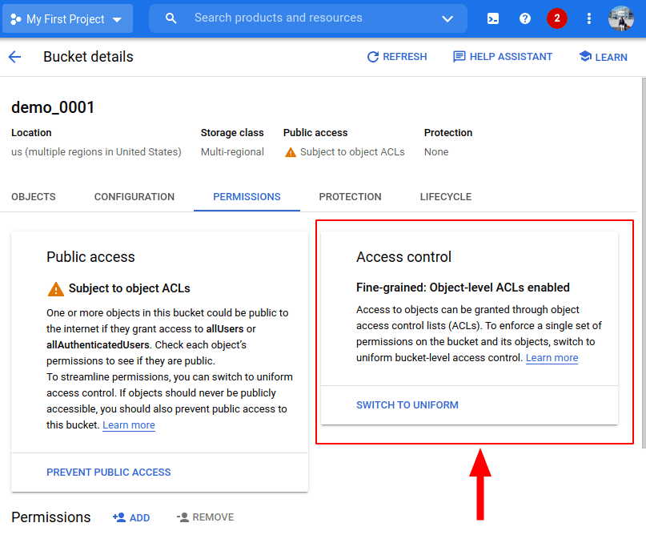
</center>
<br>

Why is this important?. It is important, because if you create a bucket using the first option an error message will arise: **"Cannot insert legacy ACL for an object when uniform bucket-level access is enabled. Read more at https://cloud.google.com/storage/docs/uniform-bucket-level-access"**.

```{r}
demo_data <- data.frame(a = 1:10, b = 1:10)

# Bad --------------------------------------------------
googleCloudStorageR::gcs_upload(
  file = demo_data,
  name = "demo_data.csv",
  bucket = "demo_0002" # Bucket with uniform control access
)
#  Error: Insert legacy ACL for an object when uniform bucket-level access
#  is enabled. Read more at https://cloud.google.com/storage/docs/uniform-bucket-level-access


# Good -------------------------------------------------
googleCloudStorageR::gcs_upload(
  file = demo_data,
  name = "demo_data.csv",
  bucket = "demo_0002", # Bucket with uniform control access
  predefinedAcl = "bucketLevel"
)
```

It happens due that `googleCloudStorageaR` by default expects buckets created with fine-grained access (ACL support, see [cloudyr/googleCloudStorageR#111](https://github.com/cloudyr/googleCloudStorageR/issues/111)). 
To avoid this issue, from rgee  v.1.3 we opt to change the default predefinedAcl argument from 'private' to 'bucketLevel'. This simple change should avoid users dealing with access control issues. However, if for some reason a user needs to change the access control policy (maybe to reduce the data exposure), from rgee v.1.2.0 all the rgee GCS functions ([sf_as_ee](https://r-spatial.github.io/rgee/reference/sf_as_ee.html), [local_to_gcs](https://r-spatial.github.io/rgee/reference/local_to_gcs.html), [raster_as_ee](https://r-spatial.github.io/rgee/reference/raster_as_ee.html), and [stars_as_ee](https://r-spatial.github.io/rgee/reference/stars_as_ee.html)) support the `predefinedAcl` argument too (Thanks to @[jsocolar](https://github.com/jsocolar)).

## **ERROR in Earth Engine servers: Unable to write to bucket demo_0001 (permission denied).**

This error arises when GEE tries to send an exported task results but your **EE USER** does not have enough privileges to write/read the bucket. **Why does this occur if I have successfully configured my SaK in my local system?**. Well, the SaK ensures a smooth connection between your local environment and GCS, but **not between GEE and GCS**.

<br>
<center>
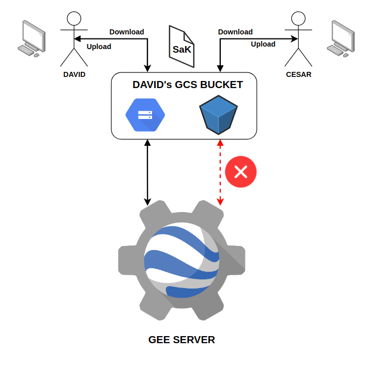
</center>
<br>

For instance, imagine that you have access to 2 Google user accounts, one personal and one for your work (in this example, we will call them David and Cesar). Both accounts have access to GEE. David creates a SaK and sends it to Cesar. As a result of this action, both Cesar and David can work together in the same bucket, downloading and creating GCS objects (Local <-> GCS). If David tries to use `ee_as_raster(..., via='gcs')` (from GEE -> GCS -> Local), GEE will recognize that the owner of the bucket is David so it will allow the procedure (GEE -> GCS) and thanks to the SaK there will be no problem to send the information to his local environment (GCS -> Local). However, if Cesar tries to do the same, it will get an error when passing the information from GEE -> GCS because **GEE does not know that Cesar has David SaK in their local system**.

```{r}
library(rgee)

ee_Initialize(gcs = TRUE)


# Define an image.
img <- ee$Image("LANDSAT/LC08/C01/T1_SR/LC08_038029_20180810")$
  select(c("B4", "B3", "B2"))$
  divide(10000)

# Define an area of interest.
geometry <- ee$Geometry$Rectangle(
  coords = c(-110.8, 44.6, -110.6, 44.7),
  proj = "EPSG:4326",
  geodesic = FALSE
)

img_03 <- ee_as_raster(
  image = img,
  region = geometry,
  container = "demo_0001",
  via = "gcs",
  scale = 1000
)

# ERROR in Earth Engine servers: Unable to write to bucket demo_0001 (permission denied).
```

This error is quite easy to fix. Just go to the bucket in your Google Cloud Platform console.

<br>
<center>
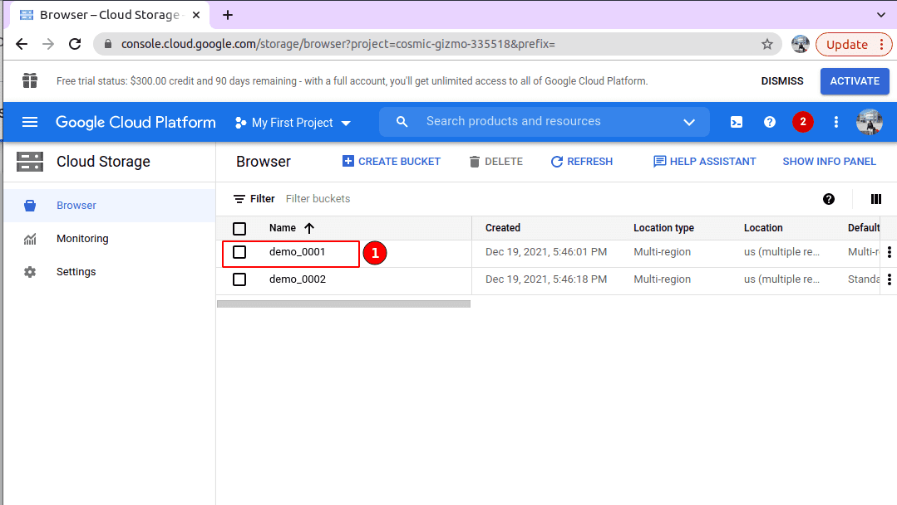
</center>

Click on 'PERMISSIONS', and click on 'ADD'.

<center>
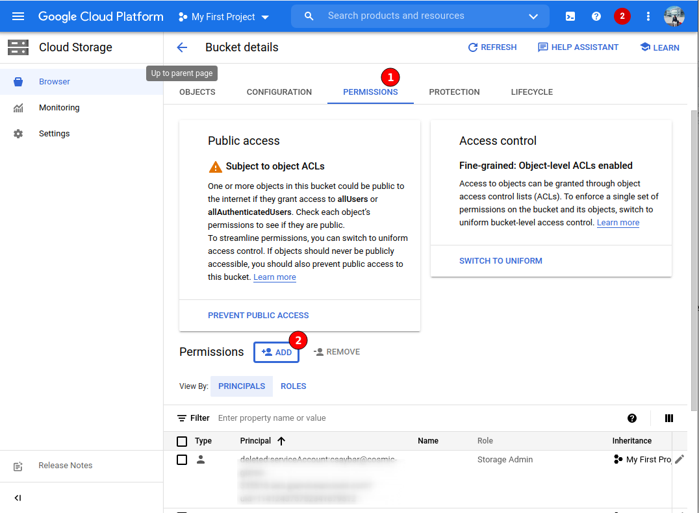
</center>

Finally, add the Google user account of the **EE USER**. **Do not forget to add 'STORAGE ADMIN' in the role!**

<center>
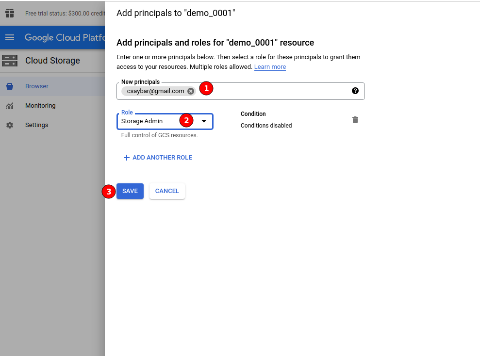
</center>
<br>

## **Conclusion**

Setting up a SaK for GCS can be quite frustrating but it is definitely worth it!. If you are still having problems setting up your SaK, feel free to clearly detail your problem in [rgee issues](https://github.com/r-spatial/rgee/issues).
